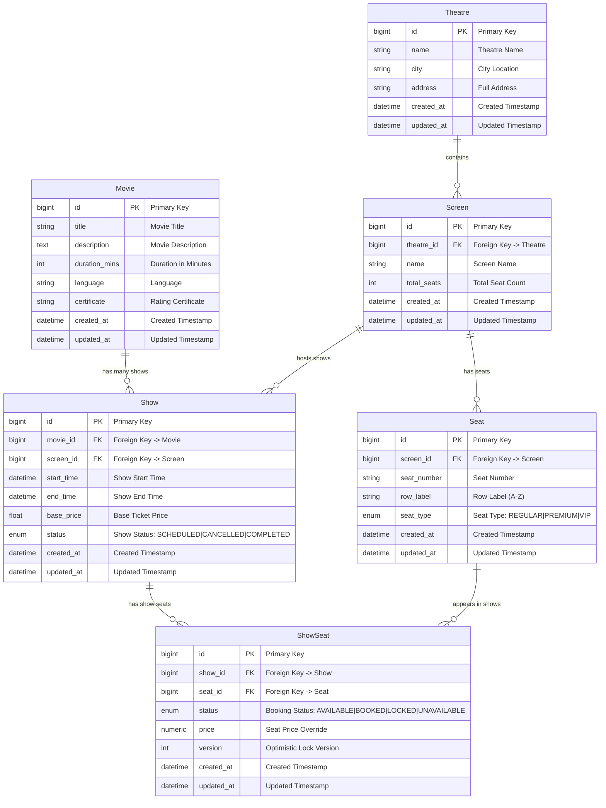
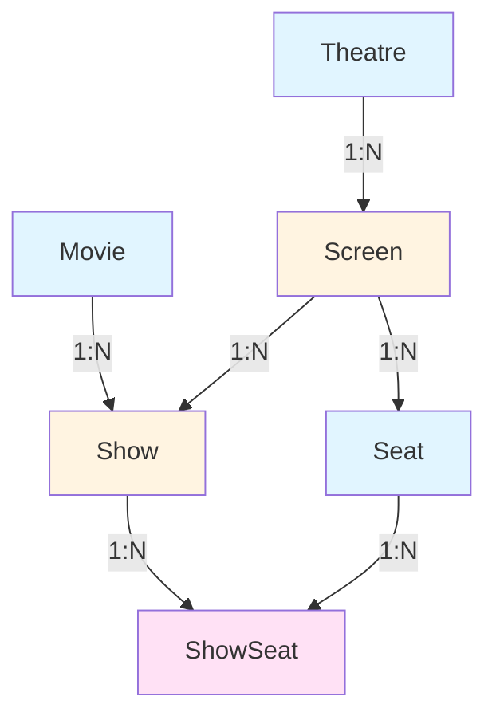

# Database Schema Diagram

## Entity Relationship Diagram

### Comprehensive ER Diagram

### Simplified Relationship View

### Relationship Cardinality Details

| Relationship | Type | Cardinality | Description |
|-------------|------|-------------|-------------|
| Movie → Show | One-to-Many | 1:N | One movie can have multiple shows |
| Theatre → Screen | One-to-Many | 1:N | One theatre contains multiple screens |
| Screen → Seat | One-to-Many | 1:N | One screen has many physical seats |
| Screen → Show | One-to-Many | 1:N | One screen hosts multiple shows |
| Show ↔ Seat | Many-to-Many | M:N | Many shows use many seats (via ShowSeat) |
| Show → ShowSeat | One-to-Many | 1:N | One show has many seat instances |
| Seat → ShowSeat | One-to-Many | 1:N | One seat appears in many show instances |

## Table Descriptions

### Movie
Stores movie information including title, description, duration, language, and certificate rating.

**Relationships:**
- One-to-Many with `Show` (a movie can have multiple shows)

### Theatre
Represents a movie theatre with location information (name, city, address).

**Relationships:**
- One-to-Many with `Screen` (a theatre has multiple screens)

### Screen
Represents a screen/auditorium within a theatre. Each screen has a total seat count.

**Relationships:**
- Many-to-One with `Theatre` (each screen belongs to one theatre)
- One-to-Many with `Seat` (a screen has many seats)
- One-to-Many with `Show` (a screen hosts multiple shows)

### Show
Represents a scheduled movie showing at a specific screen with start/end times and pricing.

**Relationships:**
- Many-to-One with `Movie` (each show is for one movie)
- Many-to-One with `Screen` (each show is at one screen)
- One-to-Many with `ShowSeat` (a show has many seat instances)

### Seat
Represents a physical seat in a screen with seat number, row label, and type (Regular/Premium/VIP).

**Relationships:**
- Many-to-One with `Screen` (each seat belongs to one screen)
- One-to-Many with `ShowSeat` (a seat can appear in multiple shows)

### ShowSeat
Junction table that represents a seat's availability and pricing for a specific show. Tracks booking status and includes optimistic locking via version field.

**Relationships:**
- Many-to-One with `Show` (each show seat belongs to one show)
- Many-to-One with `Seat` (each show seat references one seat)

## Key Relationships Summary

1. **Theatre → Screen** (1:N)
   - Cascade delete: Deleting a theatre deletes all its screens

2. **Screen → Seat** (1:N)
   - Cascade delete: Deleting a screen deletes all its seats
   - Each seat belongs to exactly one screen via `screen_id` foreign key

3. **Screen → Show** (1:N)
   - Cascade delete: Deleting a screen deletes all its shows

4. **Movie → Show** (1:N)
   - Cascade delete: Deleting a movie deletes all its shows

5. **Show ↔ Seat** (M:N via ShowSeat)
   - Many-to-many relationship through `ShowSeat` junction table
   - Tracks seat availability, pricing, and booking status per show
   - Cascade delete: Deleting a show or seat deletes related `ShowSeat` records

## Data Flow

1. **Theatre Setup**: Create a Theatre → Add Screens → Add Seats to each Screen
2. **Movie Setup**: Create a Movie → Create Shows for the Movie at specific Screens
3. **Show Management**: For each Show, create ShowSeat records linking Seats to the Show
4. **Booking**: Update ShowSeat status from AVAILABLE → LOCKED → BOOKED

## Important Notes

✅ **All foreign keys are properly defined** in the models.

### Relationship Patterns Used

1. **Cascade Deletes**: All parent-child relationships use `ondelete="CASCADE"` to maintain referential integrity
2. **Optimistic Locking**: `ShowSeat` includes a `version` field to prevent concurrent booking conflicts
3. **Junction Table Pattern**: `ShowSeat` serves as a junction table for the M:N relationship between `Show` and `Seat`, allowing:
   - Per-show seat pricing (price override)
   - Per-show seat status tracking
   - Historical booking data retention

### Design Decisions

- **ShowSeat as Junction Table**: Enables the same physical seat to be reused across multiple shows with different statuses and pricing
- **Version Field**: Implements optimistic locking to prevent double-booking in concurrent scenarios
- **Status Enums**: Both `ShowStatus` and `ShowSeatStatus` use enums for type safety and data integrity

